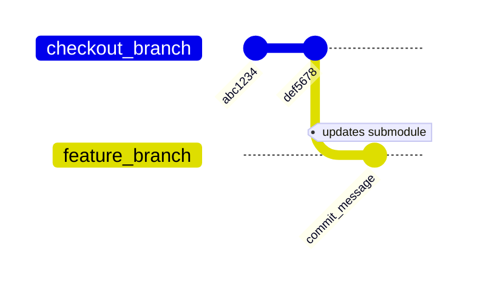
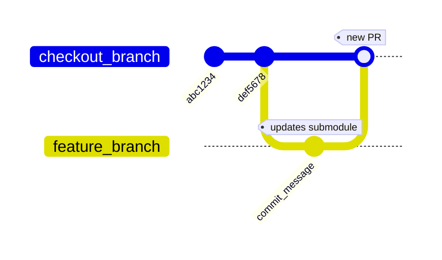

# GitHub Action: Create Pull Request for Submodule Update

This action updates a submodule of the target repository in a feature branch and 
opens a pull request against the main branch to commit changes.

If there is an open pull request already, the action will just force-push the 
feature branch.

## Parameters

- `repository` — the full name of the target repository: `<owner>/<repo>`.
  This is the repository that has a submodule to update.
- `github_token` — the GitHub token of a user with `write` permissions in the 
  target repository. Provide this token as an action secret.
- `checkout_branch` — the target repository branch to make a feature branch from;
  default is `master`.
- `feature_branch` — the new feature branch in the target repository; 
  default is `bot/update-submodule`.
- `submodule` — the submodule path to update in the target repository.
- `update_to` — update submodule to this git reference; for reliable results,
  use `SHA1` or tag.
- `commit_user` — the author of the new commit; default is `TarantoolBot`.
- `commit_user_email` — the author's email of the new commit;
  default is `bot@tarantool.io`.
- `commit_message` — the message for the commit; default is `Update submodule`.
- `create_pr` — if `true` (default), create a pull request in the target repository.
- `pr_against_branch` — the target repository branch to open a pull request 
  against; usually the same as `checkout_branch`; default is `master`.
- `pr_title` — the title of the pull request;
  default is `[Auto-generated] Update submodule`.
- `pr_description` — the description (body) of the pull request.

## Outputs

The action outputs SHA1 hashes of the new commit, created in the target repository:

* `sha` — the full 40-character value. Example: `c5e10dfd6ec566d640e974986b8fbacaf717ae15`.
* `sha7` — the shortened 7-character value, as often seen on GitHub. Example: `c5e10df`.

To access the output values, assign an id to the step that is using this action.
Then get the values like this: `${{ steps.<step-id>.outputs.sha }}`.

## How it works

First, the action checks out the target repository and makes a `feature_branch`.
Then it switches the `submodule` to `update_to` reference and makes a commit
with provided name, email and message.
Finally, it pushes the branch to the target repository:

<!-- this is a Mermaid diagram, see
https://mermaid-js.github.io/mermaid/#/gitgraph.

Configuration variables are listed in 
https://github.com/mermaid-js/mermaid/blob/59fdaa3b534e32437aeb7ac4ade9685511fb6a7e/packages/mermaid/src/defaultConfig.ts#L1129.

Without diagramPadding, diagram's area was too small, so that tag labels
did not fit in the diagram (at least on Firefox).
-->



After pushing the branch, if input variable `create_pr` is `true`,
the action opens a pull request in the target repository:



## Example workflow:

```yml
---
name: Submodule update

on:
  push:
    branches: 
    - master
    - main

jobs:
  submodule-update:
    name: Submodule update
    runs-on: docker
    env:
      SUBMODULE: 'sm'
      REPOSITORY: 'org/repo'
      CHECKOUT_BRANCH: 'main'
      FEATURE_BRANCH: 'update-submodule'
      PR_AGAINST_BRANCH: 'main'
      PR_TITLE: 'Update submodule <name> on branch <checkout branch>'
      COMMIT_USER: SomeBot
      COMMIT_USER_EMAIL: bot@example.com
      COMMIT_MESSAGE: Bump submodule to new version

    steps:
      - name: Create PR with submodule update
        uses: tarantool/actions/update-submodule@master
        id: submodule-update
        with:
          github_token: ${{ secrets.GH_TOKEN }}
          submodule: ${{ env.SUBMODULE }}
          repository: ${{ env.REPOSITORY }}
          checkout_branch: ${{ env.CHECKOUT_BRANCH }}
          feature_branch: ${{ env.FEATURE_BRANCH }}
          pr_against_branch: ${{ env.PR_AGAINST_BRANCH }}
          pr_title: ${{ env.PR_TITLE }}
          commit_user: ${{ env.COMMIT_USER }}
          commit_user_email: ${{ env.COMMIT_USER_EMAIL }}
          commit_message: ${{ env.COMMIT_MESSAGE }}

      - name: Print SHA1 of the new commit
        run: |
          echo 'full: ${{ steps.submodule-update.outputs.sha }}'
          echo 'short: ${{ steps.submodule-update.outputs.sha7 }}'
```
